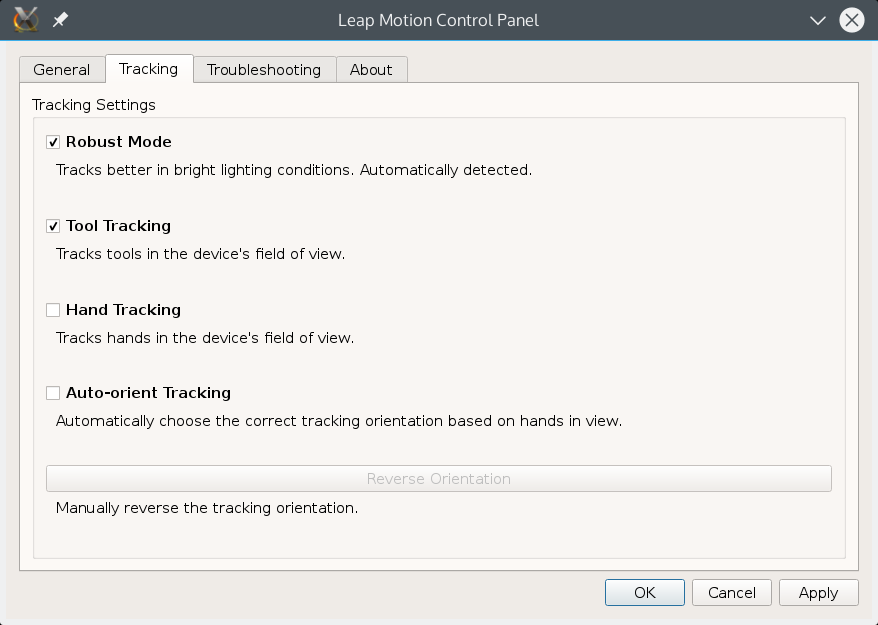

# Batería con Leap Motion

Este proyecto para la asignatura Nuevos Paradigmas de Interacción de la UGR
consta de una batería virtual.

## Autores
Sus autores somos [Antonio Álvarez Caballero](https://github.com/analca3)
y [Adrián Ranea Robles](https://github.com/ranea).

## Fecha de realización

Desde el día 16 de Octubre hasta el 2 de Diciembre.

## Descripción del problema que se aborda

El problema abordado es una batería virtual: utilizando dos lápices, rotuladores o similar,
podremos simular de manera sencilla y simple el funcionamiento de una batería.

## Descripción de la solución que se aporta

La solución propuesta es la siguiente: en un entorno virtual se dibujan cuatro regiones
cuadradas de igual tamaño. Tomando como referencia una herramienta (lápiz, bolígrafo, rotuladores...)
pintamos en pantalla algo similar a una baqueta, y al posicionarla encima de cada una
de las regiones y detectar un gesto, se reproducirá un sonido asociado a dicha región.

Manteniendo la baqueta sin realizar gestos en una determinada región, podemos cambiar
el sonido que ofrece de manera sencilla.

### Instalación

Para poder ejecutar este proyecto, hacen falta varias cosas:

* Python
* Pygame
* Leap Motion SDK

Para instalar esto en nuestras máquinas de desarrollo (Archlinux x86_64), sólo hacen
falta un par de órdenes. Notar que [pacman](https://wiki.archlinux.org/index.php/Pacman)
es el gestor de paquetes de Archlinux y [pacaur](https://aur.archlinux.org/packages/pacaur/)
es un wrapper para instalar paquetes de la comunidad fácilmente. En caso de no tenerlo
se pueden acceder a los paquetes de Leap de la comunidad desde [aquí](https://aur.archlinux.org/packages/?O=0&K=leap+motion)

```bash
$ sudo pacman -Syu python2 python2-opengl python2-numpy python2-pygame
$ pacaur -Syu leap-motion-driver leap-motion-sdk
```

Al instalar el SDK de Leap Motion, debemos modificar el PKGBUILD para añadir ${pkgdir} en dos de las
últimas líneas, quedando así

```
install -D -m644 "${pkgdir}/usr/lib/Leap/Leap.py" "${pkgdir}/usr/lib/python2.7/site-packages/Leap.py"
install -D -m644 "${pkgdir}/usr/lib/Leap/LeapPython.so" "${pkgdir}/usr/lib/python2.7/site-packages/LeapPython.so"
```

En otras distribuciones de GNU/Linux es probable que estén los paquetes de Python en los
repositorios oficiales, pero en caso de que no, se pueden instalar usando **pip**. En la
página oficial de Leap Motion también encontramos descargas para GNU/Linux.

Después de esto, deberíamos ser capaces de ejecutar nuestro proyecto sin ningún problema.

### Ejecución

En Archlinux, bastaría conectar el Leap Motion mediante los comandos:
```bash
$ sudo leapd
```

Recomendamos la siguiente configuración en el panel de control de leap. En ArchLinux, puedes abrir dicho panel buscando la aplicación *Leap Motion Control Panel*. También puedes ejecutarla por consola

```bash
$ LeapControlPanel
```



Para ejecutarlo este programa, basta escribir:
```bash
$ python2 drums.py
```

### Uso

Cuando ejecutes el programa, encontrarás un tutorial con la información necesaria para usar el programa.

Presta atención y... ¡disfruta tocando!

Entra en la configuración y verás algunas opciones que puedes modificar: volumen, sonidos y pantalla completa. Los sonidos no tienen por qué ser de batería, ¡entra y descubre cuáles son!

## Errores frecuentes o aspectos destacados

Alguno de los errores destacados han sido:

* Elección de proyecto: En un principio queríamos realizar un minijuego de tiro al arco usando Kinect, pero vimos que la precisión que nos ofrecía no era lo suficiente, por eso cambiamos a este proyecto.

* Detección de la herramienta: Pasó su tiempo en que diéramos con la herramienta correcta. Un lápiz no muy corto o un rotulador opaco y mate nos servirían como baqueta mágica.

* Detección del gesto: El gesto de Keytap no es tan intuitivo con una herramienta que con tu propio dedo, por lo que hemos tenido que habituarnos para hacerlo correctamente.

* Problemas con el 3D: La profundidad no quedaba muy bien, se precisaba de mucho esfuerzo para acertar a dar en los instrumentos, por lo que optamos por esta solución pseudo-2D.

* Parpadeo: La baqueta parpadeaba mucho, debido a que OpenGL se actualiza muy rápido y lo solucionamos poniendo un temporizador.

* Complejidad: Programar en un entorno 3D usando OpenGL no es trivial, y para añadir algo tan sencillo como imágenes fijas hay que trabajarlo mucho. Por esta razón nos pasamos a un entorno 2D usando Pygame por completo, no sólo para el tutorial.

* Movimiento de la baqueta: Posicionar un Sprite de una baqueta según la posición reconocida por Leap Motion es trivial. Lo complicado es rotarla según una dirección y que siga colisionando con el entorno de manera más o menos precisa. Se ha resuelto realizando un pequeño cálculo y aproximando.


## Lecturas recomendadas

La documentación oficial para [LeapMotion](https://developer.leapmotion.com/documentation/python/index.html) y
[Pygame](https://www.pygame.org/docs/) son imprescindibles.

## Referencias

Lo referido a [Leap Motion](https://developer.leapmotion.com/documentation/python/index.html) y
[Pygame](https://www.pygame.org/docs/) ha sido sacado de la documentación oficial.

Para Pygame se ha utilizado la documentación oficial y el ejemplo del tutorial
[chimp](https://www.pygame.org/docs/tut/chimp/ChimpLineByLine.html)

Los sonidos de ejemplo han sido sacados de [aquí](http://99sounds.org/drum-samples/)
y de [aquí](http://99sounds.org/percussion-samples/), que
son libres mientras no lo usemos en ámbito comercial.

Las imagenes la hemos sacado de:

 - [bateria electronica](https://www.google.es/imgres?imgurl=https://c1.staticflickr.com/7/6081/6026391058_5f98798c0f_b.jpg&imgrefurl=https://www.flickr.com/photos/jtjdt/6026391058&h=1024&w=1010&tbnid=kFktYv4p5FKmQM:&docid=ytmUsZe6UPWYJM&ei=qlJdVurSGInzatfHrqgP&tbm=isch&ved=0ahUKEwjqz4L1l7rJAhWJuRoKHdejC_UQMwhAKBkwGQ)
 - [rainstick](https://en.wikipedia.org/wiki/Rainstick#/media/File:Rainstick_01.png)
 - [cymbal](https://en.wikipedia.org/wiki/Cymbal#/media/File:2006-07-06_Crash_Zildjian_14.jpg)
 - [chime](https://en.wikipedia.org/wiki/Mark_tree#/media/File:Meinl_CH-12_Chimes.jpg)
 - [framedrumes](https://en.wikipedia.org/wiki/Pandeiro#/media/File:Pandeiro.jpg)
 - [drumstick](https://commons.wikimedia.org/wiki/File:Drumsticks.png)
